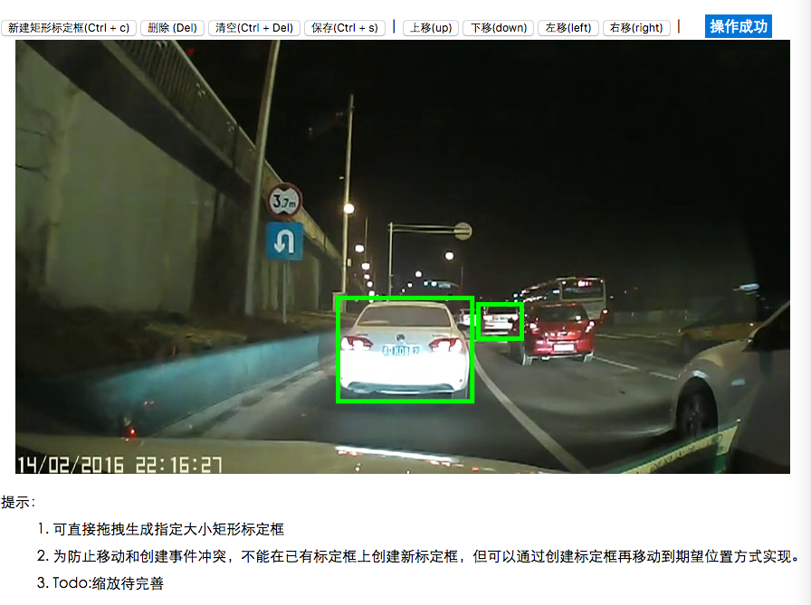

# Calibration Box

图片标定：一个 Fabric 的小插件，可用于标定图片中车辆、人、交通灯标识、区域等。

## 效果

## 运行

1. 依赖 [Node](https://nodejs.org/)、[http-server](https://github.com/indexzero/http-server)
2. 在项目目录执行 `npm install` ，安装 fabric.js、keymaster.js 库
3. 在项目目录执行 `http-server`
4. 根据 `http-server` 中提示的网址，在浏览器（建议 Chrome ）中访问
5. 关闭命令窗口即可退出

## 使用

1. 可通过 `npm install calibration-box` 安装。
2. 调用和使用方式，建议参考 index.html 中代码和注释

## 参考

- [Fabric.js 官网](http://fabricjs.com/)
- [Fabric.js Github 地址](https://github.com/kangax/fabric.js/)

## 反馈

[https://github.com/TingGe/calibration-box/issues](https://github.com/TingGe/calibration-box/issues)

## 贡献

[https://github.com/TingGe/calibration-box/graphs/contributors](https://github.com/TingGe/calibration-box/graphs/contributors)

## 许可

(The MIT License)

Copyright (c)  Kevin [505253293@163.com](mailto:505253293@163.com)

